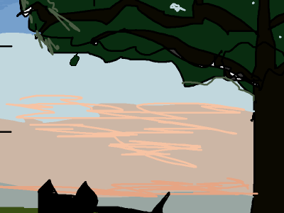

# Weijing website
Weijing personal website to show my projects in a gallery.
Contains project folders that are loaded into website. Just uses markdown files with some metadata on top.
Easily maintained in this way.
Latest updated date can be put in markdown files and will be reflected in index.html for when you last updated.

## How to build
In home directory do:
```npm run build```

## How to add stuff
In src/contents you can create a new project. Project contains a default image and an index.md markdown file you can edit. Can look at example or other ones for the metadata you need to put at top of index.md. When done, just build with npm and everything will show up.

## Placeholder graphic if image not found

