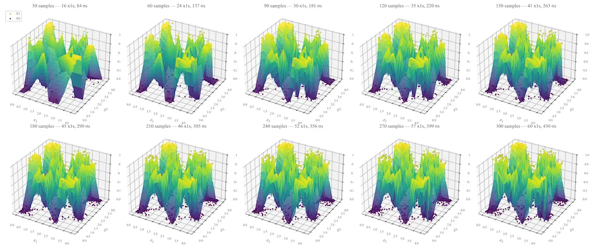

An example explanation of a dog image query. The network can trace back to exactly which dog and cat pair made the decision and with pair was the most irrelevant.

## Thesis Overview

My Master's thesis, done at UCSB and advised by [Professor Shivkumar Chandrasekaran](https://scg.ece.ucsb.edu/people.html), is about a novel way to construct neural networks without backpropogation. The goal was to design a neural network architecture that was interpretable by nature (traceable back to the training samples) but also with good generalization and robustness. This is important in critical applications (such as in medicine) where even a small error can not be tolerated. If there is an error, we should be able to debug it. Additionally, Stone nets can update learn from new training data on the fly. The thesis is under embargo for 1 year, releasing sometime around April 2027.

Incremental training is possible with this method. This means our network can learn from new training data on the fly without forgetting. Example is on 2D checkerboard for visualization purposes.